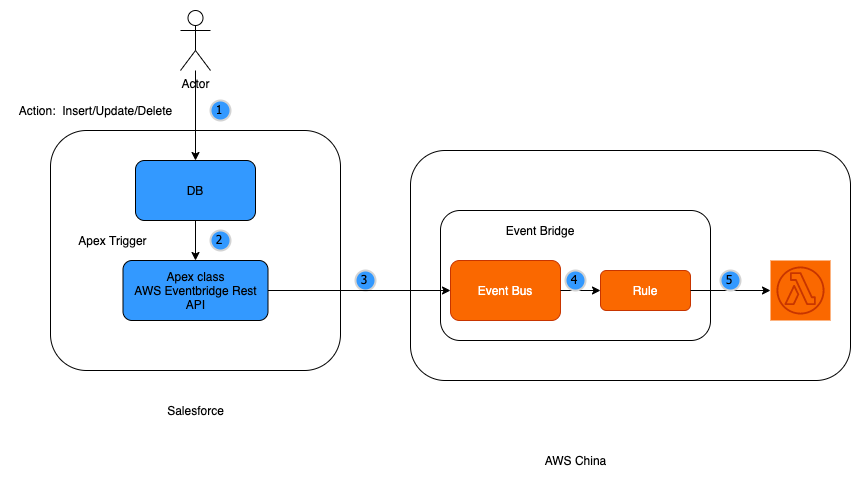
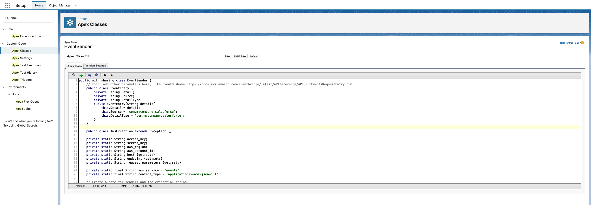
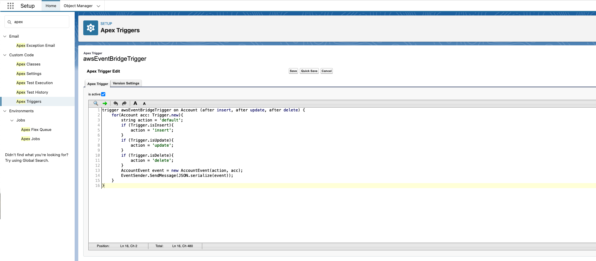
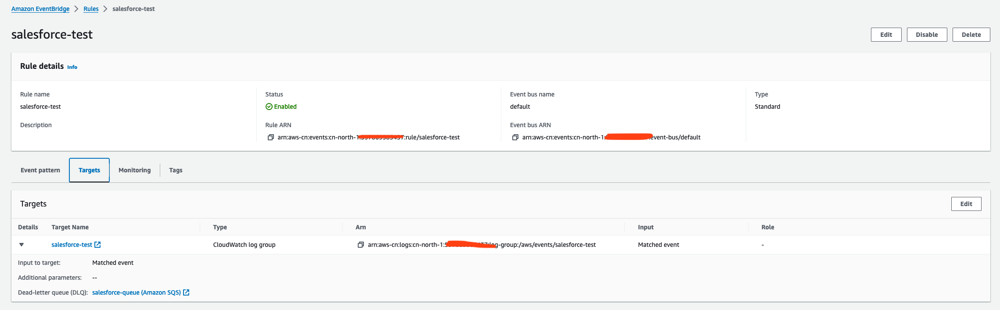
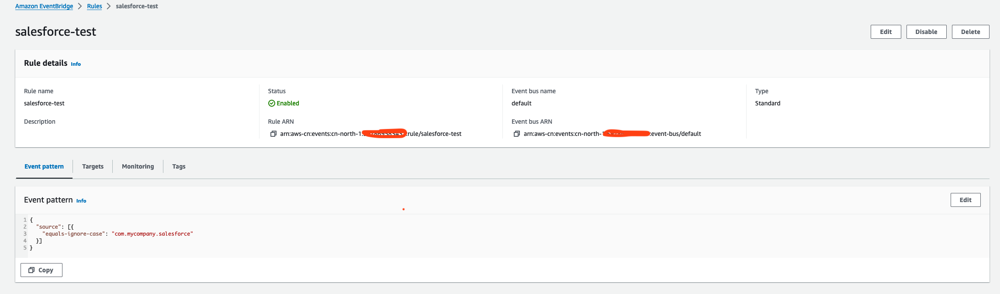
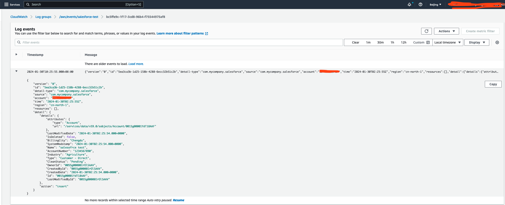

# Salesforce 与 AWS 集成方案
## Salesforce 与 AWS global的集成
Salesforce提供了2种方案与AWS的event bridge集成。 Salesforce 作为Partner Event Source的方式接入AWS event bridge。
1. 在Salesforce侧配置event relay
2. 在AWS侧配置AppFlow
但是截止目前，以上2种方式在AWS中国区都不可行。
方案一， Salesforce确认不能跟AWS中国区通过event relay的方式进行集成。
> The Salesforce EventBus Relay product, as of versions Winter 24/Spring 24 as of Jan 10 2024, enables customers to define their partner event source in all AWS regions through the UI and API. However, there is an issue when a customer tries to create a partner event source in an AWS China region.
>
>As part of this investigation, and as informed by the AWS team, accounts in any China region require special handling and do not have the same level of access as other accounts.
>
>Current discussions with AWS support and Salesforce product teams have led to the decision that, at present, the Salesforce Event Relay product cannot support an AWS China region account ID.
>
>To address this gap, the Salesforce relay team is planning key updates in the Spring 24 release patches. These updates will include modifications to the UI and API to prevent relay creation for accounts in the China region, along with revisions to the documentation to accurately reflect this change. This ensures that customers are clearly informed about this regional exception.

方案二， AppFlow在中国区没有Launch

## Salesforce与AWS中国区集成的可选方案

### 安全
相比于Salesforce提供的event relay方案，这个方案需要将AWS的credential（AK/SK）存储到Salesforce端。
需要注意以下安全策略

  * Salseforce与AWS Event Bridge直接通过https加密连接
  * AWS的credential安全的存储在Salesforce的custom metadata type里
  * 赋予AWS credential最小的可工作权限
  * 定期的重新生成AWS credential
  * 不要在日志中记录敏感信息

### 限制
  * 单条Event的大小不能超过256K
  * 每次最多发送10条Event

## 怎么使用
  * 替换apexAWSEventBridge.apex中的 AWS credential
  * 在Salesforce中创建apex class和apex trigger
  * 在AWS中国区账号中设置配置Event Bus/ Event Rule和 Target
  * 在Salesforce中创建/更新/删除账号
## 截图

